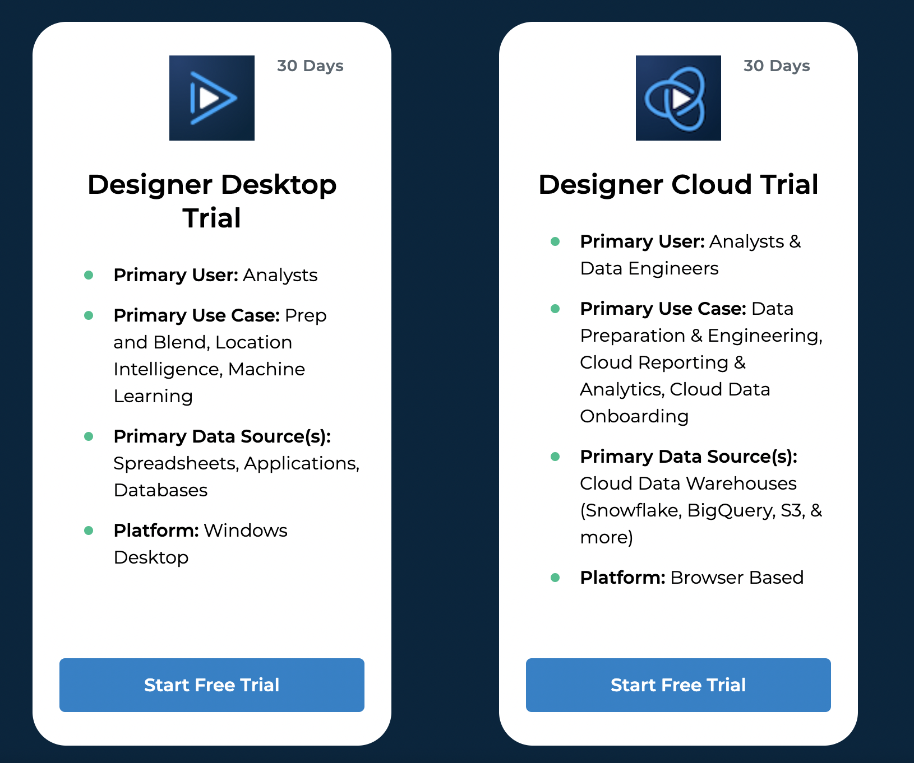
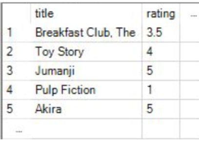

# I4_mlops_tools_Jeel : Alteryx

## What is Alteryx?

    Alteryx is a data science and analytics automation platform that helps businesses make sense of their data.
It does this by providing a drag-and-drop interface that allows users to connect to any data source, clean and 
prepare the data, and then analyze it using a variety of tools and techniques.
 
 Alteryx also includes a number of pre-built workflows that can be used to solve common business problems, such 
as churn prediction, customer segmentation, and fraud detection.

Here are some of the benefits of using Alteryx:
-  It can help businesses make better decisions by providing them with insights into their data.
-  It is a relatively easy-to-use tool that can be used by people with a variety of data science skills.

### Installing Alteryx:
You can download the application from here: https://www.alteryx.com/designer-trial/free-trial-alteryx
You can choose a plan based on your requirement, you also have a 30 day free trial on the website:

### Running the Movie Recommendation Workflow:

#### Downloading Data:
The Data is taken from Kaggle. MovieLens Dataset is used in this case and can be found here: https://www.kaggle.com/datasets/grouplens/movielens-20m-dataset

The files used have not been uploaded here due to size constraints,

You can download the following files that have been used as input:
- movie.csv
- rating.csv

#### Running the Workflow:

1. The "movie_recommendation_movielens_final.yxmd" file contains the workflow for the Recommendation Engine.
Import this file after installing Alteryx.
2. Enter your ratings in the node "My Movie Ratings" (You will be able to see a table such as the one below)

3. Double click on the input data nodes and browse for you input data files (rating.csv and movie.csv).
4. Click on run in the upper right corner.

#### More information about the tool can be found in I4_Alteryx.pdf
